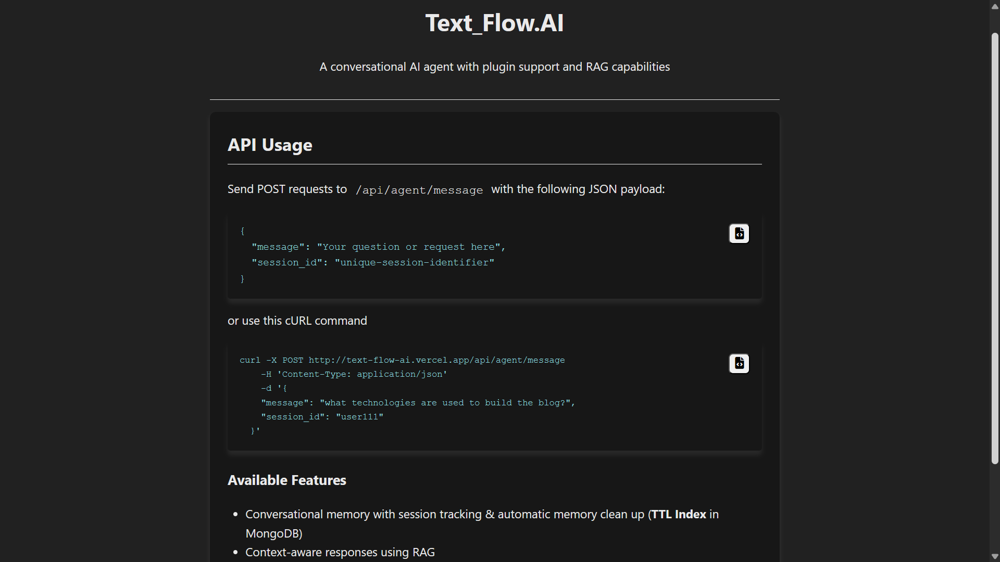

# Text Flow AI

A conversational AI agent with plugin support and Retrieval Augmented Generation (RAG) capabilities.

## API Usage

### Sample cURL Command

```bash
curl -X POST http://text-flow-ai.vercel.app/api/agent/message \
  -H "Content-Type: application/json" \
  -d '{
    "message": "What is the weather in bengaluru?",
    "session_id": "user123"
  }'
```

### Sample cURL command related to the sample files

```bash
curl -X POST http://text-flow-ai.vercel.app/api/agent/message \
  -H "Content-Type: application/json" \
  -d '{
    "message": "What is a key difference between Markdown and other lightweight markup languages?",
    "session_id": "user111"
  }'
```

### Postman Setup

1. Create a new POST request to `http://text-flow-ai.vercel.app/api/agent/message`
2. Set Headers: `Content-Type: application/json`
3. Set Body (raw, JSON):

```json
{
	"message": "What is the weather in bengaluru?",
	"session_id": "user123"
}
```

## Frontend Interface

I have deployed a simple frontend interface at the root route (`/`) that provides:

- Interactive documentation
- Copy-paste API examples

You can access this page at [http://text-flow-ai.vercel.app/](http://text-flow-ai.vercel.app/)



## Key Features

- **Conversation Memory**: Persistent conversation history with MongoDB backend
- **RAG Capabilities**: Retrieves relevant context from your knowledge base
- **Plugin System**: Extendable with weather, math, calendar, and custom plugins
- **Session Management**: TTL-based cleanup of inactive sessions
- **Context Integration**: Combines conversation history with retrieved knowledge

## Architecture Overview

```
┌─────────────────┐     ┌──────────────────┐     ┌────────────────┐
│  Client Request │───▶│  API Router      │────▶│  Query Type    │
└─────────────────┘     │  /agent/message  │     │  Detection     │
                        └──────────────────┘     └────────┬───────┘
                                                          │
                                                          ▼
┌─────────────────┐     ┌──────────────────┐     ┌────────────────┐
│  MongoDB Store  │◀──▶│  Agent LLM      │◀─── │  Plugin System │
│  (Conversations)│     │  Response Gen    │     │  (Tools)       │
└─────────────────┘     └──────────────────┘     └────────────────┘
                                 ▲
                                 │
                         ┌───────▼──────┐
                         ┤   RAG System │
                         │  (Pinecone)  │
                         └──────────────┘
```

## Agent Flow

1. User sends message to `/api/agent/message` endpoint
2. System detects query type (weather, math, date, general)
3. If applicable, specialized plugin handles the request
4. Last two conversation context is retrieved from MongoDB and cached to memory.
5. Relevant information is retrieved from Pinecone vector DB
6. Agent LLM generates comprehensive response using all context
7. Response is stored in MongoDB and returned to user

## Project Overview

Text Flow AI is a conversational AI agent system that combines modern language models with structured plugins and context retrieval capabilities. The project implements an intelligent chat interface that maintains conversation history while providing specialized functionality through a plugin architecture.

The core of the system is built around a two-stage classification approach that first identifies the query type and then routes requests to appropriate plugins. The application features conversation memory with MongoDB-based session tracking and automatic cleanup through TTL indexes.

A key feature is the Retrieval Augmented Generation (RAG) system that enhances responses with information from a knowledge base stored in Pinecone. The system retrieves relevant context from markdown documents to provide more informed and accurate responses.

## Tech Stack

### Frontend

- **Next.js**: React framework for the UI layer
- **TypeScript**: Static typing for JavaScript
- **CSS**: Custom styling for the interface
- **Font Awesome**: Icon library

### Backend

- **Next.js API Routes**: Server-side API endpoints
- **Node.js**: JavaScript runtime environment

### Database & Storage

- **MongoDB**: Persistent storage for conversation history with TTL indexing
- **Pinecone**: Vector database for RAG system document retrieval

### AI Components

- **LLM Integration**: Gemini model for response generation
- **Vector Embeddings**: For document similarity search
- **Plugin System**: Modular architecture for specialized capabilities

### Development Tools

- **ESLint**: Code quality and style checking
- **TypeScript**: Type safety across the codebase
- **Git**: Version control

### Deployment

- **Vercel**: Hosting platform for the application

## Setup Instructions

### Prerequisites

- Node.js 18+ and npm
- MongoDB Atlas account
- Pinecone account (for vector database)
- AI model API key (Gemini)

### Installation

1. Clone the repository to your local machine

```bash
    git clone https://github.com/shanks-d-fury/TextFlow.ai
```

2. Install dependencies

```bash
    npm install
```

3. Set up environment variables

```bash
    cp .env.example .env
```

4. Configure your .env file with:

```
    MONGODB_URL                =your_mongodb_atlas_connection_string
    PINECONE_API_KEY           =your_pinecone_api_key
    PINECONE_INDEX_NAME        =your_index_name
    AI_MODEL_API_KEY           =your_model_api_key
    SYSTEM_INSTRUCTION_PLUGIN  =Custom system instruction {returns :type of query}
    SYSTEM_INSTRUCTION_AGENT   =Custom system instruction for the ai_agent
```

5. Run the development server

```bash
    npm run dev
```

## Deployment

```bash
# Build the application
npm run build

# Start the production server
npm start
```
